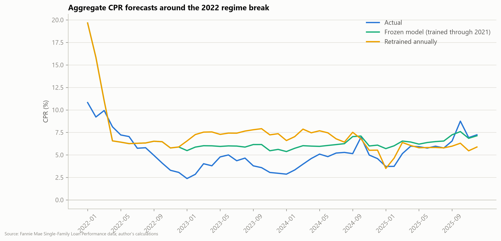
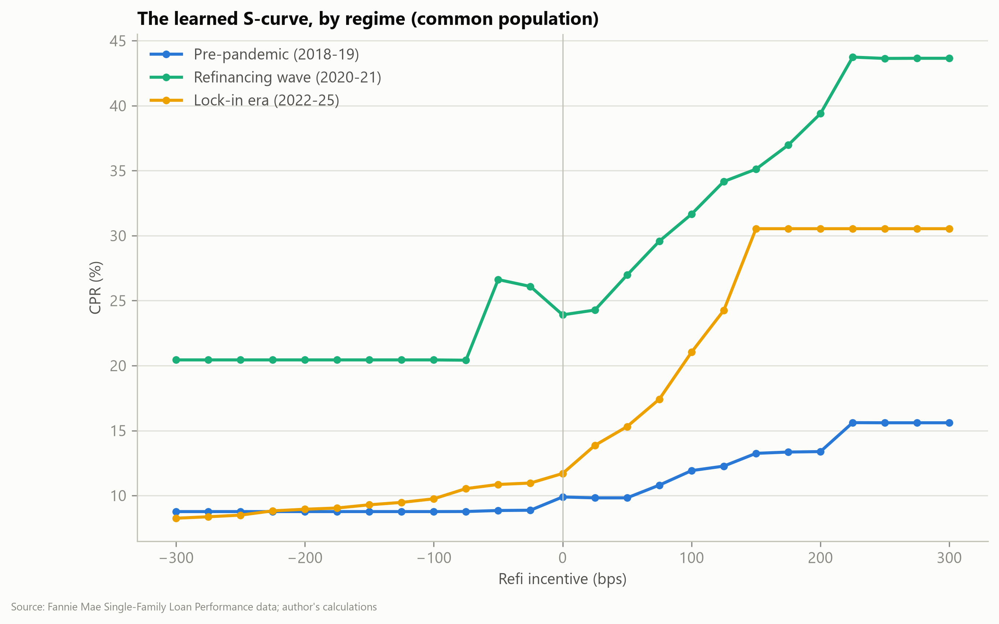
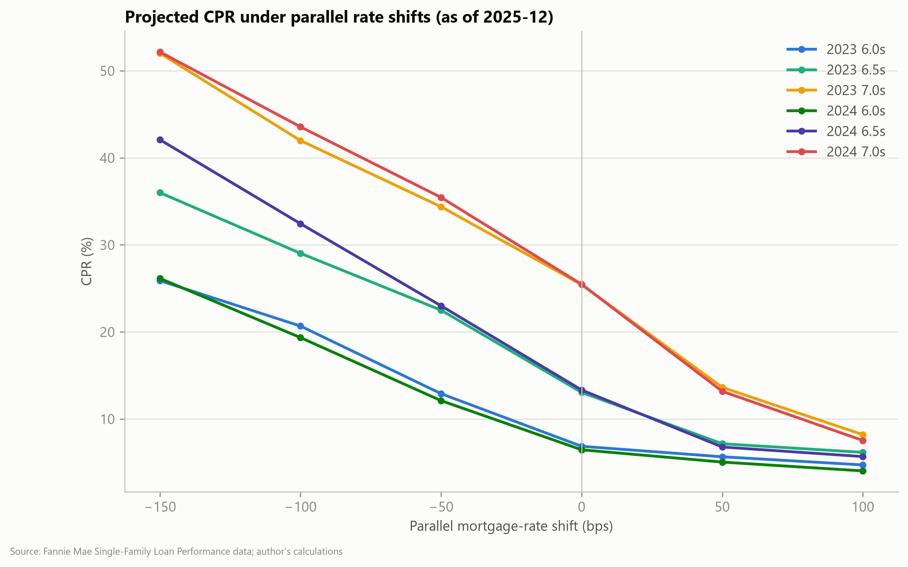

# The S-Curve After the Shock

**What a machine-learned prepayment model says about the mortgage lock-in era.**
Loan-level hazard models (logistic, LightGBM, SSG-style neural net) trained on
18.5M Fannie Mae loans (2018–2025), used to measure how the prepayment function
changed after the 2022 rate shock — and what that implies for today's coupon stack.

📄 **[Read the paper (PDF)](docs/paper/paper.pdf)**

## The three headline results

| | |
|---|---|
|  | **1. The regime break was a forecasting disaster in both directions.** The model in production in Jan-2022 over-predicted aggregate speeds by ~9 CPR. Retraining annually made 2023 *worse* (3.8 vs 2.3 CPR pts error vs a frozen 2021 model) — it took ~2 years of lock-in data for retraining to win. |
|  | **2. Lock-in didn't flatten the S-curve — it rotated it.** Conditional on composition, the refi limb is *steeper* than pre-COVID (30 vs 13 CPR at +150bp; elasticity 12.6 vs 2.2 pts/100bp), while deep-discount turnover works through the rate-level channel. |
|  | **3. The 2023–24 high-coupon stack is one rally from wave speeds.** As of Dec-2025: 7.0s ≈ 25 CPR flat, 43 CPR −100bp, 52 CPR −150bp. The 6.5s triple between flat and −150. |

## Reproduce everything

Runs on an 8GB laptop + free Kaggle GPU. Total data footprint ~25GB.

```powershell
# 0. Register (free) at https://datadynamics.fanniemae.com and download
#    quarterly zips (2018Q1+) into data/raw/fannie/
py -3.11 -m venv .venv
.venv\Scripts\pip install -e .[dev]
.venv\Scripts\python scripts/run_external.py      # PMMS + FHFA HPI (public APIs)
.venv\Scripts\python scripts/make_layout.py "data/raw/fannie/<layout-file>.xlsx"
.venv\Scripts\python scripts/run_ingest.py        # raw -> parquet, 3GB RAM cap
.venv\Scripts\python scripts/run_cohorts.py       # full-population CPR ground truth
.venv\Scripts\python scripts/run_panel.py         # sampled hazard panel
.venv\Scripts\python scripts/run_models.py        # walk-forward logistic + GBM
.venv\Scripts\python scripts/run_experiments.py   # E1/E2/E3 + robustness appendix
# NN: scripts/export_kaggle.py then notebooks/kaggle_nn_training.py on Kaggle GPU
# Verify: .venv\Scripts\pytest
```

`pytest` — 42 unit tests, including regression tests for three data-leakage
modes specific to this dataset (see [docs/leakage-audit.md](docs/leakage-audit.md):
Fannie blanks monthly fields on removal records, so unlagged state fields
perfectly flag the prepayment event).

## What's in here

- `src/scurve/` — ingestion, cohort actuals, sampling, features, models, experiments
- `docs/paper/` — the writeup (Typst source + PDF)
- `docs/research/literature-survey.md` — verified literature review (SSG, lock-in, practitioner record)
- `artifacts/figures`, `artifacts/tables` — every number in the paper, reproducible

## Disclaimer

Personal educational research on public data. Not investment advice. Views are my
own and not those of my employer. The Fannie Mae Single-Family Loan Performance
dataset is used under its terms; no raw loan-level data is redistributed here.

## License

MIT
